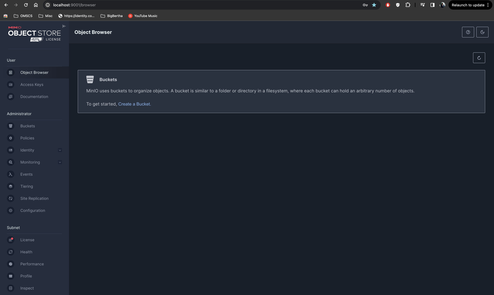
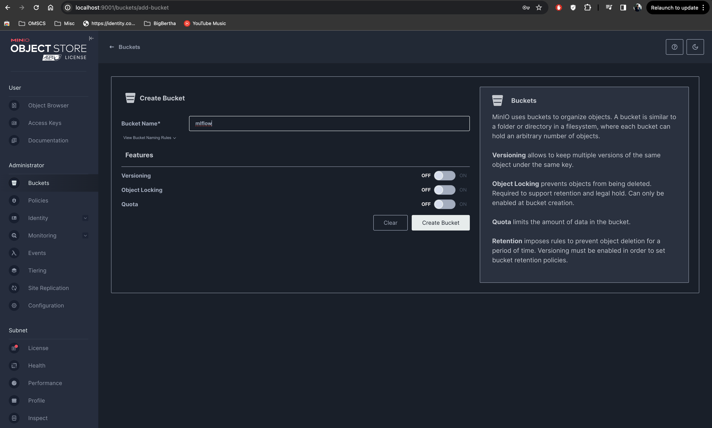
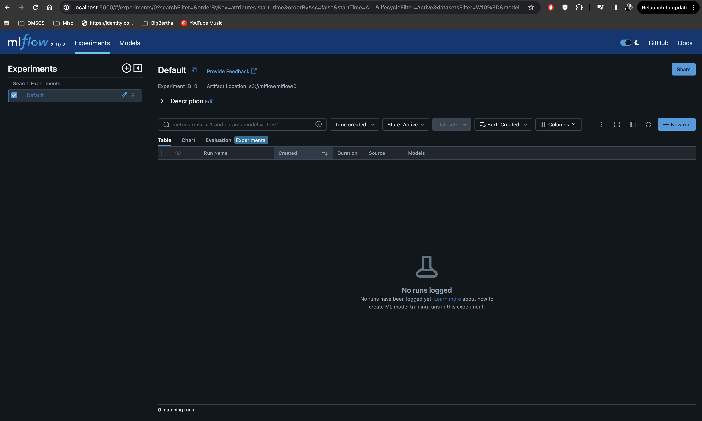

# Installation Guide

## 0. Prerequisites
ToDo

## 1. Cluster Setup
1. Setup the Kubernetes cluster using [kubeadm](setup_k8s.md)
2. Setup argocd by running the [argocd installation script](../scripts/setup_argocd.sh). `bash scripts/setup_argocd.sh` should get the job done.
3. To view ArgoCD UI, run the following to obtain admin secret and setup port-forwarding
```shell
kubectl -n argocd get secret argocd-initial-admin-secret -o jsonpath="{.data.password}" | base64 -d && echo
kubectl -n argocd port-forward svc/argocd-server 8080:80 &
```

## 2. MinIO Setup
1. To setup the prerequisites, run the [minio prerequisites script](../scripts/minio_prereq.sh). `bash scripts/minio_prereq.sh` should get the job done.
2. Run the command `kubectl apply -f apps/minio.yaml` which will install MinIO as an argocd app
3. Navigate to ArgoCD UI, select the MinIO app and click on "Sync">"Synchronize"
4. Observe to ensure that everything gets setup correctly, including the logs of the minio pod

5. To navigate to MinIO console, setup port-forwarding using `kubectl -n minio port-forward svc/minio-console 9001`
6. Login using the username "admin" and password "password" (as is set in [config](../apps/minio.yaml))
7. You should eventually end up on the MinIO console


## 3. Postgres Setup
1. To setup the prerequisites, run the [postgres prerequisites script](../scripts/postgres_prereq.sh). `bash scripts/postgres_prereq.sh` should get the job done.
2. Run the command `kubectl apply -f apps/postgres.yaml`
3. Navigate to ArgoCD UI, select the Postgres app and click on "Sync">"Synchronize"
4. Observe to ensure that everything gets setup correctly, including the logs of the postgres pod

5. For further interactions with postgres (eg: creating mlflow database), we need the psql client. Install it using `sudo apt-get install postgresql-client`.
6. You can run `psql --version` to verify installation

## 4. MLFlow Setup
1. Ensure that MinIO and Postgres are setup as specified in steps 2 and 3 above
2. On MinIO create a new bucket called "mlflow" 
3. Run the following commands to setup the "mlflow" database in Postgres
```shell
kubectl -n postgresql port-forward svc/postgres-postgresql 5432 &
psql -h localhost -p 5432 -U postgres
#Enter password "password" when prompted
CREATE DATABASE mlflow;
\q
```
4. Run the command `kubectl apply -f apps/mlflow.yaml`
5. Navigate to ArgoCD UI, select the MLFlow app and click on "Sync">"Synchronize"
6. Observe to ensure that everything gets setup correctly, including the logs of the mlflow pod

7. You can use `kubectl -n mlflow port-forward svc/mlflow 5000` to port-forward to the MLFlow server and UI

